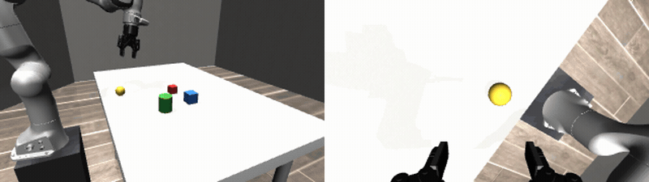
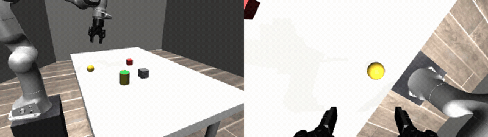
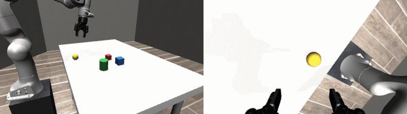
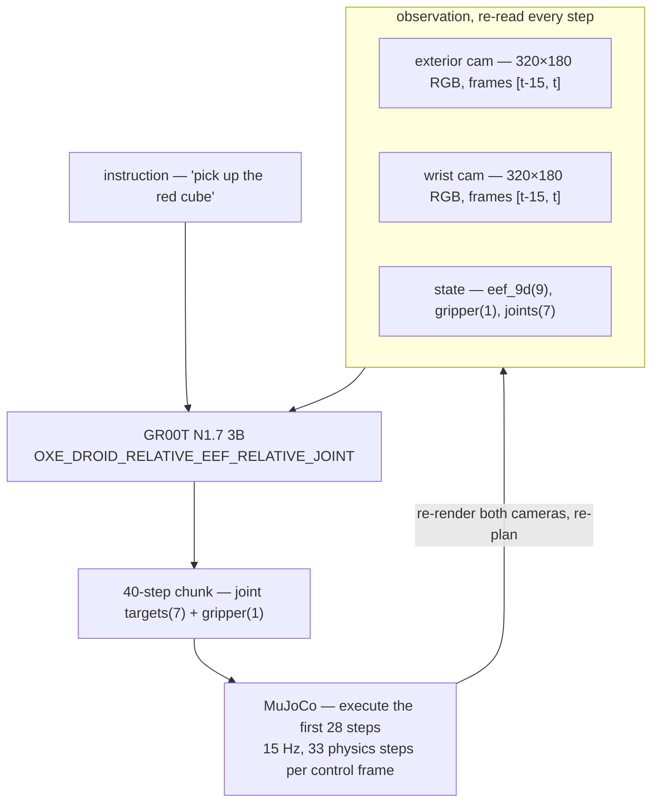

# groot-mujoco-franka


A closed inference loop: an NVIDIA Isaac GR00T policy drives a simulated Franka Panda in MuJoCo from a language instruction and two camera views.





*Both of the two successful trials out of 50. Left half: exterior camera. Right half: the wrist camera, as the policy sees it.*



*A failure — trial 1, at 6× speed. The gripper reaches the cube, nudges it without closing on it, then drifts past and never returns, running out all 20 inferences with the cube outside the wrist view. 48 of the 50 trials failed; see [Known limitations](#known-limitations-and-failure-modes).*

## Scope and status

This is a **demonstrator**, not a product and not a maintained project.

- Runs **in simulation only** (MuJoCo). There is no hardware interface in this repository.
- **No policy here has ever been deployed on a physical robot.** Nothing in it has been validated for real-robot safety.
- The policy is used **zero-shot**. No training, finetuning or post-training happens in this repository.

What it does: builds a MuJoCo scene whose geometry, cameras and lighting are chosen to keep observations inside the distribution the GR00T DROID head was trained on, then runs the perception → policy → actuation loop closed, and reports whether the cube was lifted.

What it does not do: train or finetune anything, evaluate across a task suite, calibrate its contact model against a real Robotiq 2F-85, or ship model weights or datasets.

## Architecture



| Piece | What is used |
|---|---|
| Policy | [`nvidia/GR00T-N1.7-3B`](https://huggingface.co/nvidia/GR00T-N1.7-3B), embodiment tag `OXE_DROID_RELATIVE_EEF_RELATIVE_JOINT` |
| Simulator | MuJoCo 3.10.0, elliptic friction cone, implicit-fast integrator |
| Arm | Franka Emika Panda (`panda_nohand`) + Robotiq 2F-85, from MuJoCo Menagerie via `robot-descriptions` |
| Table | robosuite 1.5.2 `TableArena` |
| Control | Position actuators on 7 arm joints; the gripper command is binarized at 0.5, as in the reference DROID client |
| Success test | Cube centre 5 cm above its resting height for 10 consecutive control frames |

Two files:

- **`scene.py`** — builds the model. The arm stands on a plinth beside the table, its base 0.17 m *below* the tabletop, because on the real DROID rig the work surface sits above the base plate; objects bolted to the tabletop land below anything the policy saw in training. The wrist camera is constructed from the physical requirement (fingers visible at the bottom of the frame, workspace unoccluded) rather than derived from an extrinsic whose reference frame could not be verified.
- **`run.py`** — the loop: render, assemble the observation, call the policy, execute part of the chunk, repeat.

## Quickstart

Python 3.10, with [uv](https://docs.astral.sh/uv/). A GPU is optional — it runs on CPU, slowly.

```bash
# 1. Isaac-GR00T provides the policy and the DROID sample episodes; it is not on PyPI.
#    It belongs beside this repository, not inside it.
git clone https://github.com/NVIDIA/Isaac-GR00T.git

# 2. This repository
git clone https://github.com/deniskr/groot-mujoco-franka.git
cd groot-mujoco-franka

# 3. Environment, from pyproject.toml (uv fetches Python 3.10 itself if you lack it)
uv sync

# 4. Run one rollout with the interactive viewer
uv run run.py --viewer
```

On macOS the interactive viewer must run under `mjpython`, which the `mujoco` package installs alongside it. `mjpython` embeds CPython and has to `dlopen` `libpython`, which uv's standalone Python keeps outside every path `mjpython` searches, so link it into the venv once:

```bash
ln -s "$(uv run python -c 'import sysconfig; print(sysconfig.get_config_var("LIBDIR"))')/libpython3.10.dylib" \
      .venv/libpython3.10.dylib
uv run mjpython run.py --viewer
```

Without a display, drop `--viewer` (`MUJOCO_GL=egl` is needed on headless Linux, not on macOS):

```bash
MUJOCO_GL=egl uv run run.py
```

Several rollouts with the cube placed randomly in x ∈ [0, 0.25], y ∈ [-0.12, 0.12]:

```bash
MUJOCO_GL=egl uv run run.py --trials 6
```

The checkpoint downloads from the Hugging Face hub on first run.

Every rollout renders both camera views into `frames/` (scratch, rewritten each time) and then compresses them side by side into `videos/<time>_<commit>_trial<n>_<lifted|failed>.mp4`. Videos accumulate and are never overwritten, so a run stays associated with the commit that produced it. `frames/` is gitignored; `videos/` is committed, and holds the batch behind the success rate below. The video step needs `ffmpeg` on `PATH` and is skipped with a message if it is missing.

Expected output: one line per inference giving the distance from the fingertip midpoint to the cube, then the verdict.

```
device: cuda
  inference 1/20: TCP-cube ‹distance› m
  inference 2/20: TCP-cube ‹distance› m
  ...
trial 1/1: lifted
  video: 20260812-104500_df606f7_trial1_lifted.mp4

1/1 lifted
```

The arm starts from a real DROID episode's first frame — end effector high and behind the cube — and descends toward it. A run ends early on success, otherwise after `--max-inferences` chunks.

## Known limitations and failure modes

- **It does not succeed reliably. Measured success rate: 2 of 50 (4%).** One unattended batch of 50 rollouts on the defaults (`--execute-steps 28`, `--max-inferences 20`), cube position drawn uniformly from x ∈ [0, 0.25], y ∈ [-0.12, 0.12] with a fixed seed. The 95% confidence interval is 0.5% to 13.7%, so read this as "it works occasionally", not as a number precise enough to compare against. Treat any single rollout as an anecdote. All 50 rollouts are in [`videos/`](videos) — the failures too, not just the two that worked.
- **The dominant gap is observation distribution, not embodiment.** DROID is a Franka Panda with a Robotiq 2F-85 — exactly what is simulated here, same action space, same embodiment tag. What differs is the pixels: flat-shaded primitives on a uniform table against DROID's cluttered, textured, warmly-lit scenes. Closing this would mean appearance and viewpoint augmentation, or finetuning on rendered frames. Neither is done here.
- **Characteristic failure: overshoot without recovery.** The loop converges laterally and vertically onto the cube, then parks with a stable offset along the table axis, past the cube. The policy carries a forward-motion prior and does not reverse once the target is behind it, so the error does not close. Residual offset ‹placeholder›.
- **Action-chunk truncation matters.** Every chunk's closest approach falls late in the 40 steps. Executing too few of them replays reach-and-reset forever and never runs the descend-and-close phase; `--execute-steps` is the dial.
- **Wrist camera coverage is uneven.** With a camera rigidly mounted beside a gripper that occupies a large part of its own frame, the workspace maps onto the lower half of the image and its far +y end is pressed against the gripper. A sweep over mount parameters found no pose that keeps the cube well framed across the whole y range; widening the field of view or accepting poor coverage of that strip are the options.
- **Flow-matching sampling noise is large relative to the effects being measured.** Two runs of the same configuration produce visibly different chunks. Single-sample comparisons below ‹placeholder› are not interpretable; use repeated trials.
- **The instruction is barely load-bearing.** The scene contains one graspable red cube; phrasing had no measurable effect in testing. This is a single hard-coded scene, not a task suite.
- **The success test is a height check.** Cube centre above a threshold for consecutive frames. It rejects a nudge, but it is not a grasp-quality metric.
- **Contacts are not calibrated.** Friction cone and `impratio` were tuned so the 2F-85 behaves plausibly, not to match measurements from real hardware.
- **CPU inference is slow.** Loading the 3B checkpoint and each inference both take a while without a GPU; per-inference latency ‹placeholder›.

## Attribution

This repository is Apache-2.0 (see [LICENSE](LICENSE)). It contains no third-party assets — every model and asset below is resolved at install or run time from its own distribution, under its own licence.

| Component | Source | Licence |
|---|---|---|
| Isaac GR00T (code) | [NVIDIA/Isaac-GR00T](https://github.com/NVIDIA/Isaac-GR00T) | Apache-2.0 |
| GR00T N1.7 3B (**weights**) | [nvidia/GR00T-N1.7-3B](https://huggingface.co/nvidia/GR00T-N1.7-3B) | [NVIDIA Open Model License](https://www.nvidia.com/en-us/agreements/enterprise-software/nvidia-open-model-license/) — separate from the code licence |
| MuJoCo | [google-deepmind/mujoco](https://github.com/google-deepmind/mujoco) | Apache-2.0 |
| Franka Emika Panda model | [MuJoCo Menagerie](https://github.com/google-deepmind/mujoco_menagerie), via `robot-descriptions` | Apache-2.0 |
| Robotiq 2F-85 model | [MuJoCo Menagerie](https://github.com/google-deepmind/mujoco_menagerie), via `robot-descriptions` | BSD-2-Clause (© 2013 ROS-Industrial) |
| Table arena | [robosuite](https://github.com/ARISE-Initiative/robosuite) | MIT |
| DROID | [droid-dataset.github.io](https://droid-dataset.github.io/) — the sample episodes distributed with Isaac-GR00T supply the start pose and frame conventions | see the dataset's own terms |

Franka, Robotiq and NVIDIA names are used only to identify the hardware and models involved. This project is not affiliated with, endorsed by, or supported by any of them.
